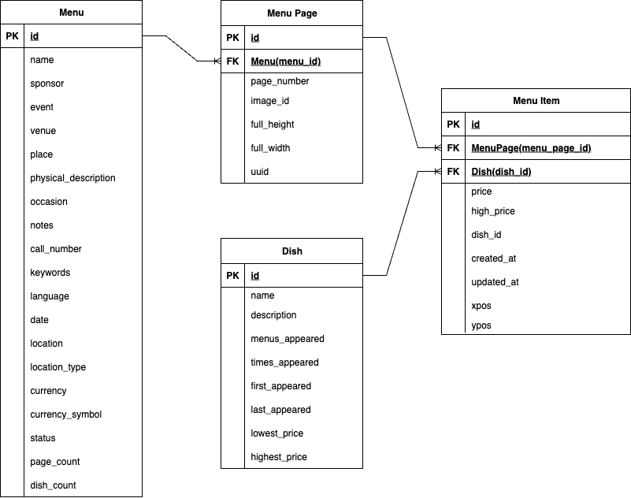
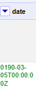
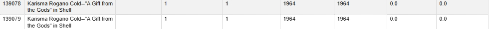

# Phase 1 Report
### Emails
- **Sam Schreiber**: srs17@illinois.edu
- **Fahad Khan**: mfkhan5@illinois.edu
- **Patrick Wu**: pywu4@illinois.edu

### Team ID
Team58

<div style="page-break-after: always;"></div>

# Task 1: Describe the Dataset 

## ER Diagram



## Description

## Origin and Source

This dataset originates from the **New York Public Library’s “What’s on the Menu?”** project, an initiative to **digitize historical menus** from the collection. The dataset contains **45,000 menus** spanning from the **1840s to the present**. As of November 2016, the transcribed database includes over **1.3 million dishes** extracted from **17,545 menus**. It consists of `Menu`, `MenuPage`, `MenuItem`, and `Dish` tables, form a relational database schema. One `Menu` can have multiple `MenuPage`s, each containing multiple `MenuItem`s, which reference a `Dish`. The dataset is available on [Kaggle](https://www.kaggle.com/datasets/nypl/whats-on-the-menu) and is updated twice monthly.

## Citations
New York Public Library. (n.d.). What’s On The Menu? Kaggle. Retrieved July 13, 2025, from https://www.kaggle.com/datasets/nypl/whats-on-the-menu/suggestions

---

## Data Structure and Attributes

The dataset is organized into **four CSV files**: `Menu`, `MenuPage`, `MenuItem`, and `Dish`, representing a relational schema.

### Menu

Represents the overall menu document.

| Column | Description |
|--------|-------------|
| `id` | Unique identifier for the menu |
| `name` | Title of the menu |
| `sponsor` | Organization or host behind the menu |
| `event` | Name of the event |
| `venue` | Type of place (e.g., COMMERCIAL) |
| `place` | City and state/country (e.g. MILWAUKEE, [WI];) |
| `physical_description` | Format and dimensions (e.g., “CARD; 5.5X8.0”) |
| `occasion` | Occasion related to the menu (e.g., holiday) |
| `notes` | Any special notes (e.g., decoration style) |
| `call_number` | Library reference number |
| `keywords` | Keywords or tags (often null) |
| `language` | Language of the menu text |
| `date` | Date the menu was issued |
| `location` | Alternate location description |
| `location_type` | Type of location (may be null) |
| `currency` | Currency used (e.g., USD) |
| `currency_symbol` | Symbol (e.g., $) |
| `status` | Processing status (e.g., “complete”) |
| `page_count` | Number of scanned pages in the menu |
| `dish_count` | Number of dishes identified on the menu |

---

### MenuPage

Represents a **single page of a menu**.

| Column | Description |
|--------|-------------|
| `id` | Unique ID for the page |
| `menu_id` | Foreign key linking to the `Menu` |
| `page_number` | Page index (starting at 1) |
| `image_id` | Identifier for the scanned image |
| `full_height` | Image height in pixels |
| `full_width` | Image width in pixels |
| `uuid` | unique identifier for the page |

---

### MenuItem

Represents a **dish offering on a specific menu page**.

| Column | Description |
|--------|-------------|
| `id` | PK |
| `menu_page_id` | Foreign key to `MenuPage` |
| `dish_id` | Foreign key to `Dish` (canonical dish concept) |
| `price` | Listed price of the dish |
| `high_price` | Optional upper bound |
| `created_at` | Timestamp when the item was entered |
| `updated_at` | Timestamp of last update |
| `xpos`, `ypos` | Coordinates in range (0,1) of the item position on the scanned image |

---

### Dish

Represents a **a dish**.

| Column | Description |
|--------|-------------|
| `id` | Unique dish ID |
| `name` | Name of the dish (e.g., “Tomato Soup”) |
| `description` | Additional details (often null) |
| `menus_appeared` | Number of distinct menus the dish appeared on |
| `times_appeared` | Total appearances (can be more than `menus_appeared`) |
| `first_appeared` | Earliest known year it appeared |
| `last_appeared` | Most recent year seen |
| `lowest_price` | Minimum price seen |
| `highest_price` | Maximum price seen |

---

## Metadata Context

- **Time Period** - 1840s-present  
- **Number of Columns** - 45 total
- **File Size** - 152.68 MB, with the bulk occupied by the `Menu Item` table (118 MB)

<div style="page-break-after: always;"></div>

# Task 2: Develop Three Use Cases
- Write three use case descriptions, one paragraph each:
  - **U1 (Main Use Case):** Data cleaning is necessary and sufficient.
  - **U0 (Zero Cleaning Use Case):** Dataset is already good enough.
  - **U2 (Never Enough Use Case):** No amount of cleaning will make the data suitable.
- For U1, define 1–3 sample queries (or analysis goals) that demonstrate why cleaning is needed.
- Clearly justify why D does or doesn’t support each use case without cleaning.


## U1 (Main Use Case):
We will measure the most popular dishes by for each decade that data is collected in the NYPL library.
We will answer questions like:
- What are the items that have the most longevity and staying power on menus throughout the ages
- How did the cost of popular dishes change over time with respect to inflation?

Cleaning is necessary for this as the dish's table is dirty.
Dish names are repeated in many forms with Coffee itself appearing in 600+ different dish types.

## U0 (Zero Cleaning Use Case):
How has the size of menus changed over the decades.
Are menus growing larger or smaller or are their sizes remaining stable?
We can answer these queries by checking the mean, median, and mode of the number of items on a menu through the years.
This requires no cleaning of the data since menu and menu items are cleanly linked in the dataset.

## U2 (Never Enough Use Case):
Any sort of data analysis that requires geography to be taken into account.
For e.g.:
- Are menus in certain parts of the world larger than others?
- How has the median price of an item changed in different parts of the world (or even the US itself)

The reason none of these questions can be answered reliably is because the "Place" column in the Menu table is filled with all kinds of inconsistent data.
Some times it refers to the city and state. Other times it refers to a ship or cruise.
Yet other times, it is left blank.
No amount of data wrangling and cleaning will allow us to derive useful results from the dataset for this usecase.

<div style="page-break-after: always;"></div>

# Task 3: Identify Data Quality Problems
- Conduct an initial data inspection using tools like SQL, OpenRefine, or Python.
- Identify and document obvious data quality issues, such as:
  - Missing or null values
  - Inconsistent formats
  - Duplicated records
  - Typographical errors
  - Violations of expected schema
- Include copied examples or screenshots of problematic data.
- Explain why each problem is significant and how it impacts the main use case (U1).

## Inconsistent Formats:


In this example, the problem is that the names column of the Dish table contains inconsistent formats of the same name. In this case, demi-tasse coffee has varying formats across different dishes, when it should all be consistent under one format. This impacts the main use case because if we want to find the most popular dishes, having inconsistent formats will decrease the counts of certain dish names, potentially skewing the results.

## Null Values:


In this example, the issue is that the entirety of the description column of the Dish table contains null values, which raises the question of whether this column should continue to exist if there are no values in it. This impacts the main use case because this is a redundant column that takes up space, and unnecessary columns should be removed to ensure maximum efficiency when querying data. 

## Violation of Expected Schema:


In this example from the Dish table, notice that for these two rows, not only are the dates for the first_appeared and last_appeared columns both zero - which goes against our expected schema since it would not make sense to have dish records from the year zero - but also the highest and lowest prices are zero, implying that the dishes are free (also, note that 40 is a strange name for a dish, meaning it could be a possible error). This is significant because it skews the data for the first_appeared, last_appeared, lowest_price, and highest_price columns. This impacts our main use case because it would unnecessarily widen the years we are considering for most popular dishes as well as skew the cost of certain popular dishes over time. 

## Typographical Error:



In this example from the Menu table, notice that one its rows contains a date where the year is 0190, which is most likely the result of a misspelling of the year 1900. This is significant because typographical errors like this would skew any data result obtained from analyzing the date column. This impacts the main use case because having misspelled dates can negatively impact our attempts to understand popular dishes in certain years if the years being analyzed are invalid.  

## Duplicate Records:



In this example from the Dish table, notice that these two records - aside from having slightly different records - have identical values for every other column, strongly indicating that these two are duplicates (also note the violation of expected schema due to zeroes in their price columns). This is significant because we do not want to have duplicate records in any of our tables. This impacts our main use case because having duplicate records would cause certain dishes to be double-counted, thereby inflating their popularity. 

<div style="page-break-after: always;"></div>

# Task 4: Initial Data Cleaning Plan
U1: 
- What are the items that have the most longevity and staying power on menus throughout the ages
- How did the cost of popular dishes change over time with respect to inflation?

S1: 
The dataset D consists of four tables: `Menu`, `MenuPage`, `MenuItem`, and `Dish`. The main use case U1 focuses on analyzing the longevity and popularity of dishes over time. This requires cleaning the `Dish` table to ensure that dish names are standardized, as many dishes appear in various forms. The `MenuItem` table will also need to be cleaned to ensure accurate linking to the `Dish` table. We also need to ensure there is no double counting, e.g. all the one to many relationships are properly maintained and determine a strategy for deciding which record to keep in case of duplicates.

S2:
We will run a profiling analysis on the dataset to identify quality problems such as:
- Duplicate dish names and variations in naming conventions or languages (like Coffee vs café).
- Violated foreign key constraints between `MenuItem` and `Dish`, `Menu` and `MenuPage`, `MenuPage` and `MenuItem`. For example, does a Menu Page really belong to a Menu? 
- Violated primary key constraints, such as null or duplicate IDs.
- Inconsistent date formats and missing dates in the `Menu` table.
- Anomalies in price data, such as unrealistic values or ranges. 

S3: 
We will use the following tools for data cleaning:
- **OpenRefine** for identifying and resolving simple issues such as case normalization, data violations, clustering + collapsing dish names
- **Azure OpenAI** to normalize dish names standardized to English without brand names or modifiers
- **SQL** for validating foreign key relationships and ensuring data integrity across tables.
- **Python** for more complex data transformations, such as merging duplicate dish records and handling missing values.

S4:
After cleaning, we will evaluate the dataset D′ by:
- Checking for the absence of duplicate dish names and ensuring that all dish names are standardized.
- Validating that all foreign key relationships are intact and correctly linked.
- Ensuring that there are no null or duplicate IDs in primary key columns.
- Confirming that date formats are consistent and that missing dates have been addressed.
- Demonstrating that the new dataset contains fewer dishes due to normalization which can be more accurately analyzed.

S5:
We will summarize the changes from D to D′ by:
- Documenting the number of dish names standardized and the reduction in duplicates.
- Listing the foreign key relationships that were corrected or established.
- Reporting on the number of records cleaned, including any removed or merged records.
- Providing statistics on the consistency of date formats and the handling of missing values.
- Summarizing how many currencies were converted to USD and the impact on price data.

## Project Task Assignments

### Sam (Focus on popular Dishes usecase)
- Standardize dish names using Azure OpenAI and collapse the dish names, updating the FK constraints.
- Overwrite the Dish's times appeared, menus appeared, first appeared, and last appeared columns with the 
values after the standardization.
- Summarize the changes made to the dataset and document the cleaning process.

### Fahad (Focus on price of popular Dishes over time usecase)

- Convert all currency to USD (maybe use forex)
```
from forex_python.converter import CurrencyRates
from datetime import datetime

cr = CurrencyRates()
date_obj = datetime(2020, 1, 1)
cr.get_rate('EUR', 'USD', date_obj)
```
- Update MenuItem prices to reflect the conversion to USD.
- Update Dish's lowest_price and highest_price columns with the converted values.
- Summarize the changes made to the dataset and document the cleaning process.

### Patrick (Focus on data integrity and consistency)
- Detect foreign key violations, such as MenuPage belongs to one Menu, MenuItem belongs to one MenuPage, and MenuItem has a valid dish and filter them out
- Fix duplicate MenuPage, and MenuItem appearing on multiple pages.
- Remove columns with 100% null values.
- Detect duplicate primary keys 
- Clean the menu date formats and ensure they are reasonable
- Summarize the changes made to the dataset and document the cleaning process.
