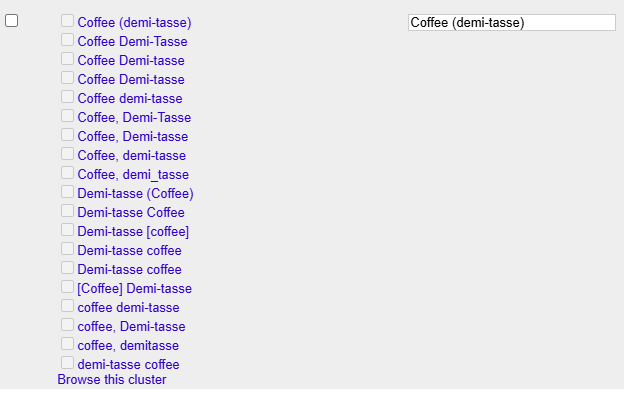
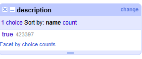

# Task 3: Identify Data Quality Problems
- Conduct an initial data inspection using tools like SQL, OpenRefine, or Python.
- Identify and document obvious data quality issues, such as:
  - Missing or null values
  - Inconsistent formats
  - Duplicated records
  - Typographical errors
  - Violations of expected schema
- Include copied examples or screenshots of problematic data.
- Explain why each problem is significant and how it impacts the main use case (U1).

## Inconsistent Formats:

In this example, the problem is that the names column of the Dish table contains inconsistent formats of the same name. In this case, demi-tasse coffee has varying formats across different dishes, when it should all be consistent under one format. This impacts the main use case because if we want to find the most popular dishes, having inconsistent formats will decrease the counts of certain dish names, potentially skewing the results.

## Null Values:

In this example, the issue is that the entirety of the description column of the Dish table contains null values, which raises the question of whether this column should continue to exist if there are no values in it. This impacts the main use case because this is a redundant column that takes up space, and unnecessary columns should be removed to ensure maximum efficiency when querying data. 

## Dirty Numeric Values:

In this example from the Dish table, notice that for these two rows, not only are the dates for the first_appeared and last_appeared columns both zero - which goes against our expectation since most rows contain dates within the past 300 years - but also the highest and lowest prices are zero, implying that the dishes are free (also, note that 40 is a strange name for a dish, meaning it could be a possible error). This is significant because it skews the data for the first_appeared, last_appeared, lowest_price, and highest_price columns. This impacts our main use case because it would unnecessarily widen the years we are considering for most popular dishes as well as skew the cost of certain popular dishes over time. 

