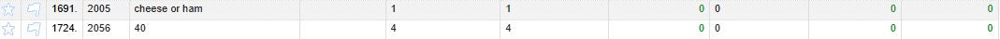
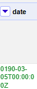
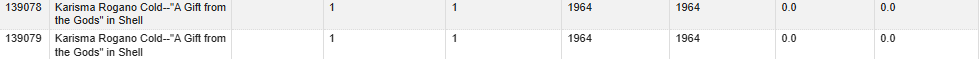

# Task 3: Identify Data Quality Problems
- Conduct an initial data inspection using tools like SQL, OpenRefine, or Python.
- Identify and document obvious data quality issues, such as:
  - Missing or null values
  - Inconsistent formats
  - Duplicated records
  - Typographical errors
  - Violations of expected schema
- Include copied examples or screenshots of problematic data.
- Explain why each problem is significant and how it impacts the main use case (U1).

## Inconsistent Formats:

In this example, the problem is that the names column of the Dish table contains inconsistent formats of the same name. In this case, demi-tasse coffee has varying formats across different dishes, when it should all be consistent under one format. This impacts the main use case because if we want to find the most popular dishes, having inconsistent formats will decrease the counts of certain dish names, potentially skewing the results.

## Null Values:

In this example, the issue is that the entirety of the description column of the Dish table contains null values, which raises the question of whether this column should continue to exist if there are no values in it. This impacts the main use case because this is a redundant column that takes up space, and unnecessary columns should be removed to ensure maximum efficiency when querying data. 

## Violation of Expected Schema:

In this example from the Dish table, notice that for these two rows, not only are the dates for the first_appeared and last_appeared columns both zero - which goes against our expected schema since it would not make sense to have dish records from the year zero - but also the highest and lowest prices are zero, implying that the dishes are free (also, note that 40 is a strange name for a dish, meaning it could be a possible error). This is significant because it skews the data for the first_appeared, last_appeared, lowest_price, and highest_price columns. This impacts our main use case because it would unnecessarily widen the years we are considering for most popular dishes as well as skew the cost of certain popular dishes over time. 

## Typographical Error:

In this example from the Menu table, notice that one its rows contains a date where the year is 0190, which is most likely the result of a misspelling of the year 1900. This is significant because typographical errors like this would skew any data result obtained from analyzing the date column. This impacts the main use case because having misspelled dates can negatively impact our attempts to understand popular dishes in certain years if the years being analyzed are invalid.  

## Duplicate Records:

In this example from the Dish table, notice that these two records - aside from having slightly different records - have identical values for every other column, strongly indicating that these two are duplicates (also note the violation of expected schema due to zeroes in their price columns). This is significant because we do not want to have duplicate records in any of our tables. This impacts our main use case because having duplicate records would cause certain dishes to be double-counted, thereby inflating their popularity. 

